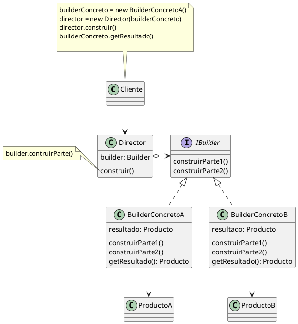

#### Estructura

#### Detalles

- La interfaz constructora declara pasos de constoruccion de producto que todos los tipos de objetos constructores tienen en comun

- Los constructores concretos ofrecen distintas implementaciones de los pasos de construccion. Los constructores concretos pueden crear productos que no siguen la interfaz comun (*Podrian implementar mas pasos?*)

- Los productos son los objetos resultantes. Los productos construidos por distntos objetos constructores no tienen que pertenecer a la misma jerarquia de clases o interfaz.

- La clase Directora define el orden en el que se invocaran los pasos de construccion, por lo que puedes crear y reutilizar configuraciones especificas de los productor.

- El cliente debe asociar uno de los objetos constructores con la clase directora. Normalmente se hace una sola vez mediante los parametros del constructor de la clase directora, que utiliza el objeto constructor para el resto de la construccion.

- Proporciona un control fino del proceso de construccion de objetos completos, que requieren multiples pasos
