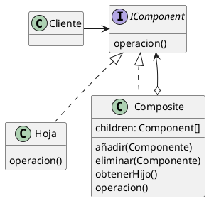
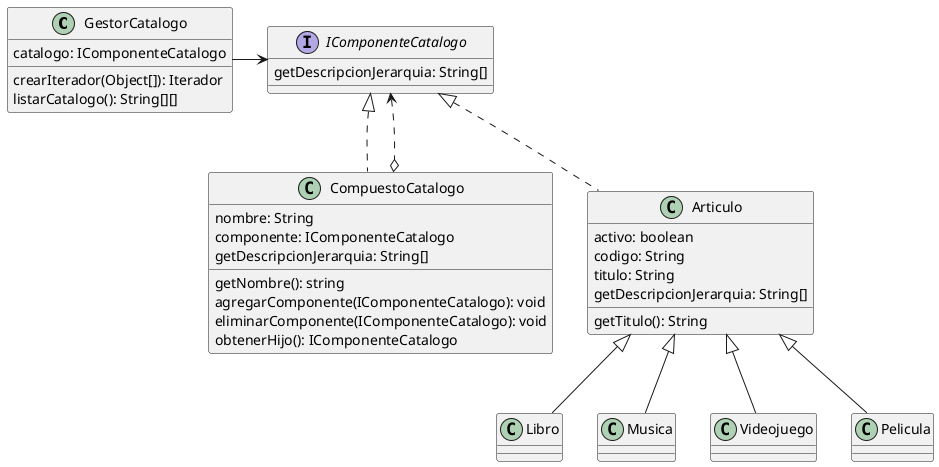
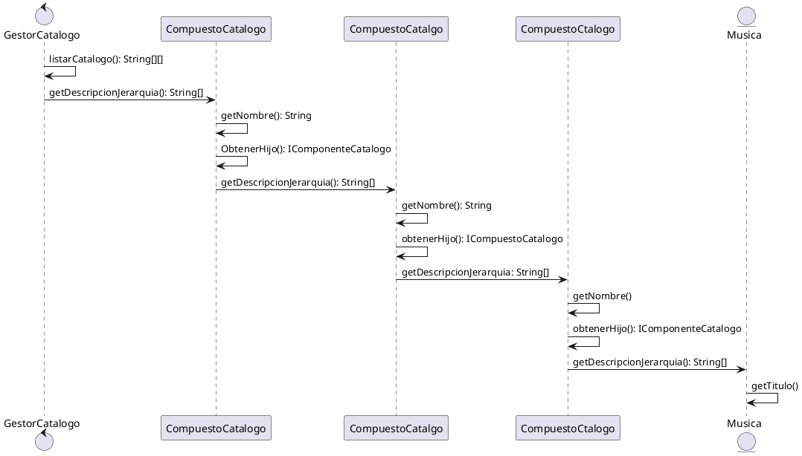

#### Estructura

#### Detalles

- La interfaz IComponent describe operaciones que son comunes a elementos simples y compuestos

- La Hoja es un elemento basico, no tiene hijos (subelementos)

- El Composite es un elemento que tiene subelementos, los subelementos pueden ser Hojas, o otros Composite. Un Composite no conoce las clases concretas de sus hijos. Funciona con todos los subelementos a traves de la interfaz IComponent

- El cliente funciona con todos los elementos a traves de la interfaz IComponent, de esta manera trabaja de la misma manera tanto con elementos simples (Hojas) como con elementos compuestos (Composite)

#### Caso de estudio Venta Digital

#### Secuencia

##### Detalles Secuencia

- El metodo polimorfico "getDescripcionJerarquia()" recorrre y devuelve el nombre de todos los elementos de la jerarquia: del catalogo activo, de las **X** secciones de dicho catalogo, de las **Y** subsecciones y de los **Z** articulos que la componen
