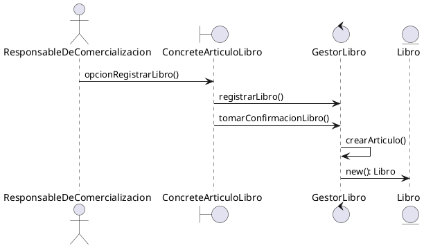

## Estructura

```plantuml
abstract Creator {
 someOperation()
 createProduct(): Product
} 
note left of Creator::someOperation
 Product p = createProduct()
 p.doStuff()
end note 
class ConcreteCreatorA <extends Creator> {
 createProduct()
}
note left of ConcreteCreatorA::createProduct()
 return new ConcreteProductB()
end note 
class ConcreteCreatorB <extends Creator> {
 createProduct()
} 
interface Product {
 doStuff()
} 
class ConcreteProductA {
 doStuff()
}
class ConcreteProductB {
 doStuff()
} 
Creator <|-- ConcreteCreatorA 
Creator <|-- ConcreteCreatorB 
Product <|.. ConcreteProductA
Product <|.. ConcreteProductB 
Creator .> Product
```

Detalles :

- Los productos concretos son distintas implementaciones de la interfaz Product

- La clase Creator es abstracta para forzar a todas las subclases a implementar sus propias versiones del método

- Los ConcreteCreators sobreescriben el Factory Method base [createProduct()], de modo que devuelva un tipo diferente de producto, dependiendo del ConcretCreator.

## Aplicacion Venta Digital

**Enunciado**

*Implementar la creación de un nuevo artículo sin que en tiempo
de compilación sea necesario determinar cuál es el tipo de
artículo que se va a crear. Deben evitarse condicionales que
cambian el comportamiento de la aplicación según el tipo de
artículo que desee crearse.*

#### Estructura

```plantuml
abstract GestorArticulo{
     someOperation()
     createArticulo(): Articulo
} 

class GestorLibro<extends GestorArticulo> {
     createArticulo(): Articulo 
}

class GestorPelicula <extends GestorArticulo> {
     createArticulo(): Articulo
}
class GestorVideojuego <extends GestorArticulo> {
     createArticulo(): Articulo
} 
class GestorMusica <extends GestorArticulo> {
     createArticulo(): Articulo
}  
interface PantallaAdmArticulo {
     adjuntarImagen()
     habilitarPantalla()
     opcionRegistrarArticulo()
     pedirAdjuntarImagen()
     pedirComentariosOtrosAutores()
     pedirConfirmacionRegArticulo()
     pedirIngresoArticulo()
     pedirSeleccionAutores()
     pedirSeleccionIdioma()
     pedirSeleccionProductora()
     pedirSeleccionTematica()
     tomarComentario()
     tomarResumen()
     tomarSeleccionIdioma()
     tomarSeleccionProductora()
     tomarSeleccionTematica()
} 

class ConcreteArticuloVideojuego {
     adjuntarImagen()
     habilitarPantalla()
     opcionRegistrarArticulo()
     pedirAdjuntarImagen()
     pedirComentariosOtrosAutores()
     pedirConfirmacionRegArticulo()
     pedirIngresoArticulo()
     pedirSeleccionAutores()
     pedirSeleccionIdioma()
     pedirSeleccionProductora()
     pedirSeleccionTematica()
     tomarComentario()
     tomarResumen()
     tomarSeleccionIdioma()
     tomarSeleccionProductora()
     tomarSeleccionTematica()
}
class ConcreteArticuloLibro {
     adjuntarImagen()
     habilitarPantalla()
     opcionRegistrarArticulo()
     pedirAdjuntarImagen()
     pedirComentariosOtrosAutores()
     pedirConfirmacionRegArticulo()
     pedirIngresoArticulo()
     pedirSeleccionAutores()
     pedirSeleccionIdioma()
     pedirSeleccionProductora()
     pedirSeleccionTematica()
     tomarComentario()
     tomarResumen()
     tomarISBN()
     tomarSeleccionIdioma()
     tomarSeleccionProductora()
     tomarSeleccionTematica()
}
class ConcreteArticuloPelicula {
     adjuntarImagen()
     habilitarPantalla()
     opcionRegistrarArticulo()
     pedirAdjuntarImagen()
     pedirComentariosOtrosAutores()
     pedirConfirmacionRegArticulo()
     pedirIngresoArticulo()
     pedirSeleccionAutores()
     pedirSeleccionIdioma()
     pedirSeleccionProductora()
     pedirSeleccionTematica()
     tomarComentario()
     tomarResumen()
     tomarSeleccionIdioma()
     tomarSeleccionProductora()
     tomarSeleccionTematica()
}
class ConcreteArticuloMusica {
     adjuntarImagen()
     habilitarPantalla()
     opcionRegistrarArticulo()
     pedirAdjuntarImagen()
     pedirComentariosOtrosAutores()
     pedirConfirmacionRegArticulo()
     pedirIngresoArticulo()
     pedirSeleccionAutores()
     pedirSeleccionIdioma()
     pedirSeleccionProductora()
     pedirSeleccionTematica()
     tomarComentario()
     tomarResumen()
     tomarSeleccionIdioma()
     tomarSeleccionProductora()
     tomarSeleccionTematica()
}
GestorArticulo<|-- GestorLibro
GestorArticulo<|-- GestorPelicula
GestorArticulo<|-- GestorVideojuego
GestorArticulo<|-- GestorMusica

GestorLibro ..|> Libro
GestorPelicula ..|> Pelicula
GestorVideojuego ..|> Videojuego
GestorMusica ..|> Musica

Musica --|> Articulo
Pelicula --|> Articulo
Videojuego --|> Articulo
Libro --|> Articulo


PantallaAdmArticulo <|.. ConcreteArticuloVideojuego 
PantallaAdmArticulo <|.. ConcreteArticuloLibro 
PantallaAdmArticulo <|.. ConcreteArticuloPelicula 
PantallaAdmArticulo <|.. ConcreteArticuloMusica 
GestorArticulo ..> PantallaAdmArticulo 
```

#### Diagrama de Secuencia


