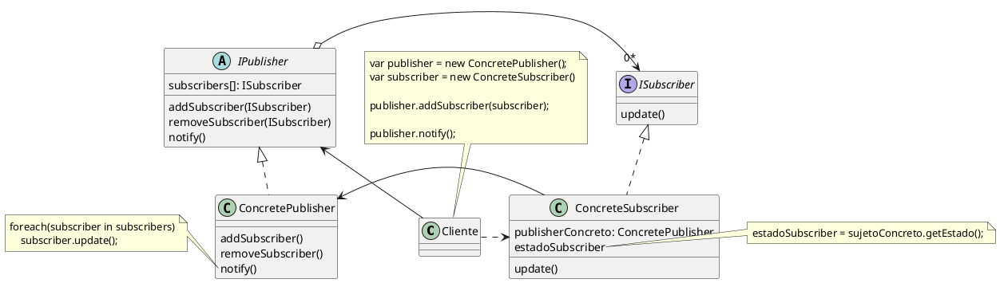
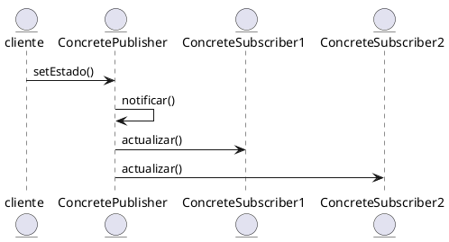

## Estructura

### Detalles

- Define una dependencia uno-a-muchos entre objetos, de modo que cuando cambia el estado de un objeto, todos sus dependientes automaticamente son notificados y actualizados

- Acoplamiento minimo entre Publisher y Subscribers

- Publisher no necesita conocer las clases concretas de Subscribers

- Subscribers pueden añadirse sin modificar el Publisher

## Secuencia

