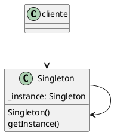

```plantuml
@startuml

class cliente
class Singleton

cliente --> Singleton
Singleton --> Singleton

Singleton : _instance: Singleton
Singleton : Singleton()
Singleton : getInstance()


@enduml
```
