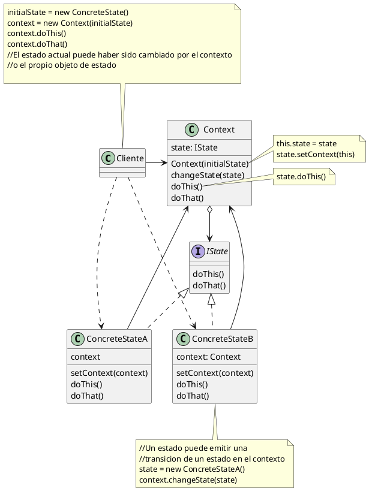
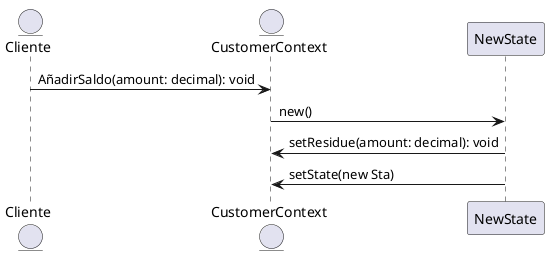

## Estructura

#### Detalles

- La clase **Context** almacena una referencia a uno de los estados concretos y le delega todo el trabajo especifico del estado. El contexto se comunica con el estado concreto a traves de la interfaz **IState**. El contexto expone un modificador para pasarle un nuevo objeto de estado.

- La interfaz **IState** declara los metodos especificos del estado, debe ser implementada por todos los estados concretos. Los metodos deben tener sentido para todos los estados, ya que sino habria metodos en desuso dependiendo de el estado concreto.

- Los objetos de estado pueden almacenar una referencia inversa al objeto de contexto (en el diagrama es así, en la filmina de meles no). A traves de esta referencia , el estado puede extraer cualquier informacion requerida del objeto de contexto, asi como iniciar transiciones de estado. Si no se tiene esta referencia al contexto, los estados concretos no podrian iniciar transiciones hacia otros estados.

#### Secuencia

###### Ejemplo Customers, sacado de udemy (curso hector d leon)

