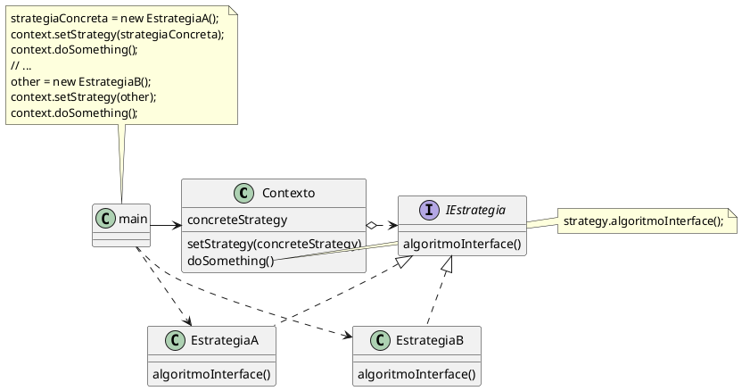
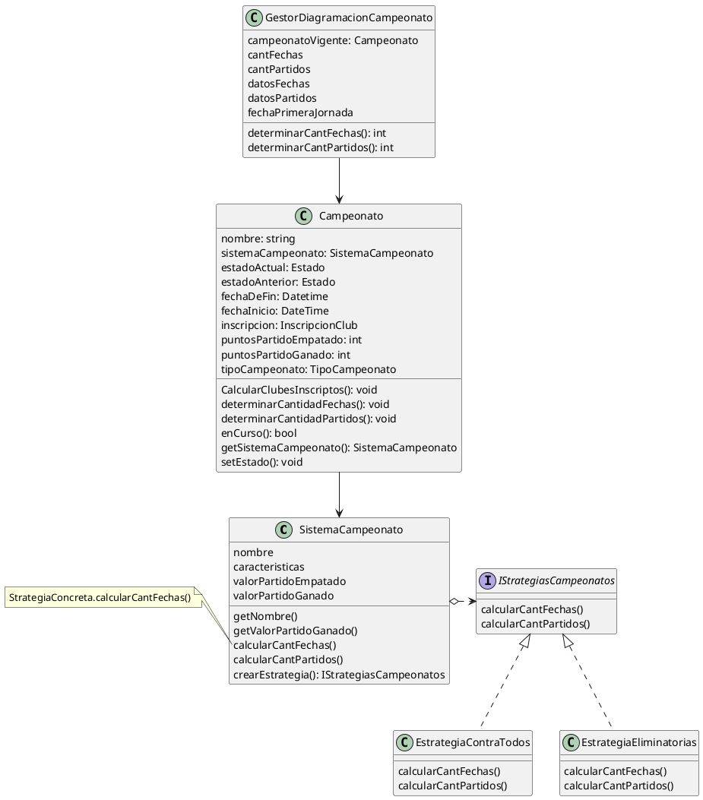

## Estructura



#### Propósito

- Define una familia de algoritmos, encapsula cada uno, y permite intercambiarlos. Permite variar los algoritmos de forma independiente de los clientes que lo usan.

- Encapsular el algoritmo en clases de estrategias concretas nos permite variar el algoritmo independientemente de su contexto.

- El contexto conoce la implementacion de **algoritmoInterface()** en tiempo de ejecucion 

#### Detalles

- La clase **Contexto** mantiene una referencia a una de las estrategias concretas y se comunica con este objeto a traves de la interfaz IEstrategia

- La clase contexto invoca el método de ejecución en el objeto de estrategia vinculado cada vez que necesita ejecutar el algoritmo. La clase contexto no necesita con que tipo de estrategia funciona o como se ejecuta el algoritmo

- El **Cliente** crea un objeto de estrategia concreta y se lo pasa a la clase contexto por  parametro (inyeccion de dependencia ?). La clase contexto expone un modificador set *(Vendria a ser el strategySelector)* que permite a los clientes sustituir la estrategia asocidada al contexto durante el tiempo de ejecucion

## Caso Liga de futbol

##### Estructura



##### Secuencia

```plantuml
control GestorDiagramacionCampeonato
entity Campeonato
entity SistemaCampeonato

GestorDiagramacionCampeonato -> GestorDiagramacionCampeonato: determinarCantFechas(): int 
GestorDiagramacionCampeonato -> Campeonato: determinarCantFechas(club: club[]): int
Campeonato -> SistemaCampeonato: calcCantidadFechas()
SistemaCampeonato -> SistemaCampeonato: crearEstrategia(): IStrategiasCampeonatos
SistemaCampeonato -> EstrategiaContraTodos: new(): EstrategiaContraTodos
SistemaCampeonato -> EstrategiaContraTodos: calcCantidadFechas(club: Club[]): int
```

##### Dudas

- El metodo crearEstrategia(), el strategy selector, donde debe ir? entiendo que en el sistema campeonato que es quien compone las estrategias.  Quien tiene relacion de composicion con IStrategiasCampeonatos. 
