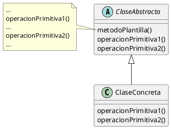

## Estructura

### Detalles

- Template method se basa en la herencia, no en la implementacion de una interfaz, por lo que los metodos pueden tener alguna implementacion por defecto.

- Las clases concretas deben necesariamente implementar los metodos que no tienen implementacion por defecto (los metodos abstractos).

- 

